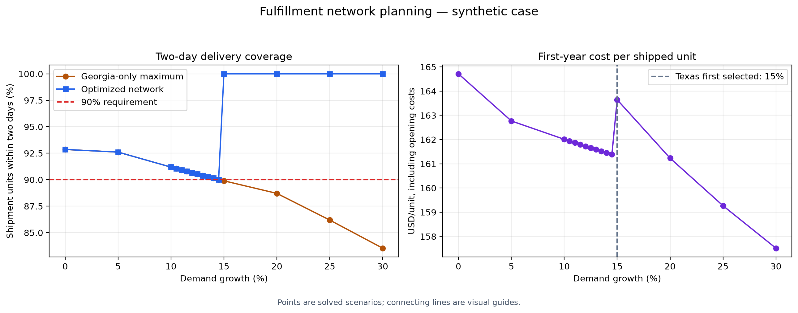

# Fulfillment Network Optimization

A Wayfair-inspired operations analytics project using Python,
PuLP 4 and the free CBC solver.

All data is synthetic. This project is not affiliated with Wayfair
and does not use internal company data.

## Business question

Which fulfillment centers should open, and how should demand be
allocated to minimize cost while providing two-day delivery
coverage to at least 90% of shipment units?

## Network

- Two existing centers: New Jersey and California
- Three candidate sites: Ohio, Texas and Georgia
- Eight customer regions
- Forty outbound shipping lanes
- One standardized bulky-item category

## Model

The expansion model is a MILP with 40 continuous shipment variables,
3 binary opening decisions and 15 business constraints.

The objective includes one-time opening costs, annual fixed
operating costs, shipping costs and handling costs.

Constraints enforce demand fulfillment, peak-week capacity,
facility activation, delivery coverage and the opening budget.

Weekly shipments are multiplied by 1.2 to test peak capacity
and by 52 to calculate annual variable costs.

## Baseline comparison

| Metric | Existing-only baseline | Open Georgia |
|---|---:|---:|
| First-year cost | $13,645,400 | $11,991,280 |
| Two-day coverage | 52.14% | 92.86% |

Modeled first-year cost reduction:
$1,654,120, or 12.1%.

The baseline measures service without enforcing the 90% target.
It is an optimized existing-network benchmark, not observed
company performance.

## Demand-growth results

| Growth | Weekly demand | New sites | First-year cost | Optimized coverage | Georgia-only maximum |
|---|---:|---|---:|---:|---:|
| 0% | 1,400 | GA | $11,991,280.00 | 92.86% | 92.86% |
| 5% | 1,470 | GA | $12,442,050.64 | 92.61% | 92.61% |
| 10% | 1,540 | GA | $12,973,854.64 | 91.19% | 91.19% |
| 10.5% | 1,547 | GA | $13,027,035.04 | 91.06% | 91.06% |
| 11% | 1,554 | GA | $13,080,215.44 | 90.92% | 90.92% |
| 11.5% | 1,561 | GA | $13,133,395.84 | 90.79% | 90.79% |
| 12% | 1,568 | GA | $13,186,576.24 | 90.66% | 90.66% |
| 12.5% | 1,575 | GA | $13,239,756.64 | 90.53% | 90.53% |
| 13% | 1,582 | GA | $13,292,937.04 | 90.40% | 90.40% |
| 13.5% | 1,589 | GA | $13,346,117.44 | 90.27% | 90.27% |
| 14% | 1,596 | GA | $13,399,297.84 | 90.15% | 90.15% |
| 14.5% | 1,603 | GA | $13,452,478.24 | 90.02% | 90.02% |
| 15% | 1,610 | TX + GA | $13,700,400.00 | 100.00% | 89.90% |
| 20% | 1,680 | TX + GA | $14,085,200.00 | 100.00% | 88.71% |
| 25% | 1,750 | TX + GA | $14,493,400.00 | 100.00% | 86.19% |
| 30% | 1,820 | TX + GA | $14,907,216.00 | 100.00% | 83.53% |

## Investment finding

Georgia alone meets the target at 14.5% growth, with approximately
90.02% maximum coverage. At 15% growth, its maximum falls to
89.90%, and the optimized model selects Texas plus Georgia.

The tested investment trigger is above 14.5% and at or below
15% growth. This is a grid result, not an exact threshold.

At 25% growth, Georgia alone achieves at most 86.19% coverage.
The optimized Texas-plus-Georgia network achieves 100%.

## Project files

- network_optimization.py: current-demand expansion
- baseline_network.py: existing-only benchmark
- demand_growth_scenario.py: 25% demand growth
- georgia_only_stress_test.py: fixed-network service limit
- growth_sensitivity.py: broad growth scenarios
- growth_threshold.py: refined growth scenarios
- project_summary.py: chart and README generation

## Setup

Use Python 3.12 or newer. Run these commands:

    python3 -m venv .venv
    source .venv/bin/activate
    python -m pip install "pulp[cbc]" matplotlib

On Apple Silicon macOS, install Homebrew CBC:

    brew install cbc

The scripts use /opt/homebrew/bin/cbc.
Change the solver path for other machines.

## Run

    python network_optimization.py
    python baseline_network.py
    python demand_growth_scenario.py
    python georgia_only_stress_test.py
    python growth_sensitivity.py
    python growth_threshold.py
    python project_summary.py

## Validation

CBC reported optimal solutions for the baseline, expansion and
growth scenarios. A coverage-maximizing LP diagnosed why the
Georgia-only network could not meet the target at higher demand.

CBC's log excludes the constant $2 million existing-center cost.
The Python total-cost report includes it.

## Assumptions and limitations

- All numeric inputs and facility locations are synthetic.
- Delivery coverage uses deterministic assumed route times.
- Coverage is not measured on-time delivery reliability.
- Inventory and replenishment are assumed sufficient.
- Inbound freight and inventory carrying costs are excluded.
- Candidate facilities can open immediately.
- Growth scenarios reconsider investment decisions.
- Fractional shipments represent average planning volumes.
- Peak demand preserves average-week allocation proportions.

## Recommendation

Open Georgia for current demand. Prepare further expansion before
growth reaches the modeled service limit. Actual investment timing
must account for construction lead times, demand uncertainty
and multi-year financial returns.
